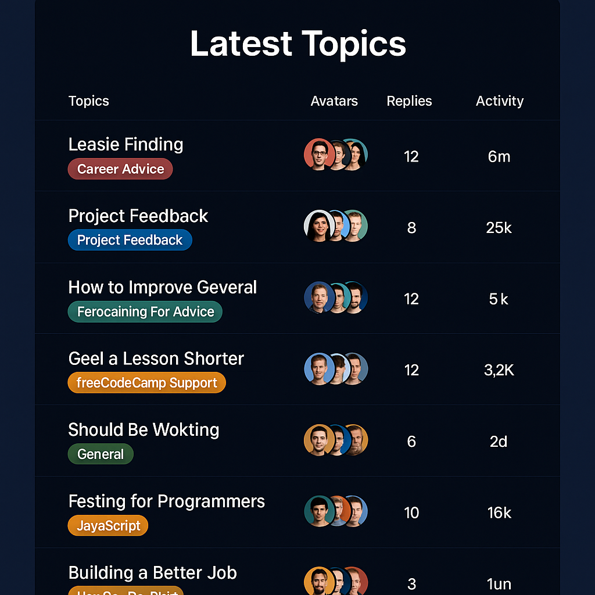

# 🏆 fCC Forum Leaderboard

A modern, responsive leaderboard that displays the latest topics from the freeCodeCamp forum. Built using HTML, CSS, and JavaScript, the app fetches live data and presents it in a clean, user-friendly table format with avatars, reply count, views, and activity times.

## 🚀 Features

- Fetches real-time latest topics from freeCodeCamp's forum.
- Displays:
  - Topic title (with link)
  - Category label with color styling
  - User avatars
  - Reply count
  - View count (with formatting like 2k)
  - Time since last activity (e.g., 5m ago)
- Fully responsive table layout with horizontal scroll on small devices.
- Beautiful category badges using CSS classes.
- Avatars handled via external image templates.

## 🛠️ Technologies Used

- HTML5
- CSS3 (custom properties and responsive design)
- Vanilla JavaScript (ES6+)
- Fetch API

## 📸 Screenshot

## 🧪 How to Use

1. Clone the repository or download the files.
2. Open `index.html` in your browser.
3. The leaderboard will automatically fetch and display the latest topics from the freeCodeCamp forum.

## 📦 API Reference

- **Forum Data Source:**  
  `https://cdn.freecodecamp.org/curriculum/forum-latest/latest.json`

## 🧠 Learnings

- How to work with JSON APIs.
- DOM manipulation and template rendering.
- CSS responsiveness and modern design techniques.
- Converting timestamps into relative time (e.g., "3h ago").

## ✨ Future Enhancements

- Pagination or lazy loading for more topics.
- Search/filter topics by category or keywords.
- Sorting options for views/replies/activity.

## 📄 License

This project is for educational purposes only. All forum data is publicly available and used respectfully under freeCodeCamp's guidelines.

